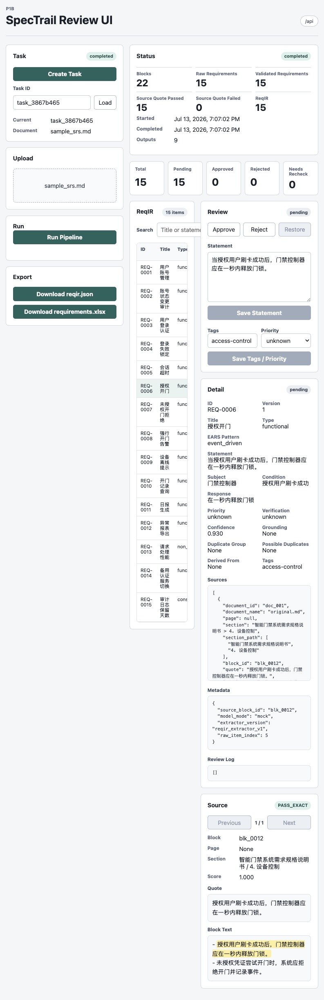
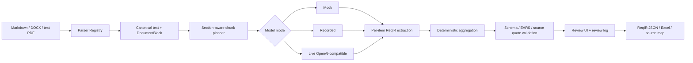

# SpecTrail

SpecTrail is a local-first pipeline that turns requirements documents into grounded ReqIR JSON and Excel exports. It currently supports Markdown, DOCX, and text-based PDF inputs with human review and source quote validation.

[](https://github.com/HugoWang232608/spectrail/actions/workflows/ci.yml)
[](LICENSE)
[](pyproject.toml)

## From source document to reviewed requirement

SpecTrail keeps the generated requirement, its source evidence, review state, and export row connected throughout the workflow.

```json
{
  "id": "REQ-0006",
  "type": "functional",
  "ears_pattern": "event_driven",
  "statement": "授权用户刷卡成功后，门禁控制器应在一秒内释放门锁。",
  "source": {
    "block_id": "blk_0012",
    "quote": "授权用户刷卡成功后，门禁控制器应在一秒内释放门锁。",
    "match_status": "PASS_EXACT"
  },
  "review_status": "pending"
}
```

> **Source quote:** “授权用户刷卡成功后，门禁控制器应在一秒内释放门锁。”
>
> **Validation:** exact match in `blk_0012`; the requirement is eligible for human review and export.

The Review UI keeps the candidate, editable fields, structured ReqIR detail, and highlighted source block visible in one workspace:



The Excel export preserves the same traceability fields for downstream review and handoff:

| ID | Statement | EARS Pattern | Review Status | Source Block | Source Match |
| --- | --- | --- | --- | --- | --- |
| REQ-0006 | 授权用户刷卡成功后，门禁控制器应在一秒内释放门锁。 | event_driven | pending | blk_0012 | PASS_EXACT |

The generated workbook contains 17 columns, including the normalized statement, subject, condition, response, confidence, review status, source quote, match status, and tags.

## Architecture



## Quick start

```bash
python -m pip install -e ".[dev]"
python -m spectrail extract docs/sample_srs.md --model-mode mock --output outputs/demo
```

Then inspect `outputs/demo/exports/reqir.json` and `outputs/demo/exports/requirements.xlsx`, or start the API and Review UI using the walkthrough below.

## P0 Demo

Install dependencies:

```bash
python -m pip install -e ".[dev]"
```

Run the deterministic mock pipeline:

```bash
python -m spectrail extract docs/sample_srs.md --model-mode mock --output outputs/demo
```

Expected outputs:

```text
outputs/demo/plan.json
outputs/demo/run_manifest.json
outputs/demo/parsed/document.md
outputs/demo/parsed/blocks.json
outputs/demo/extracted/reqir.raw.json
outputs/demo/extracted/reqir.validated.json
outputs/demo/extracted/source_map.json
outputs/demo/extracted/validation_report.json
outputs/demo/review/review_log.json
outputs/demo/exports/reqir.json
outputs/demo/exports/requirements.xlsx
```

Re-run validation and write the report:

```bash
python -m spectrail validate outputs/demo/extracted/reqir.raw.json \
  --blocks outputs/demo/parsed/blocks.json \
  --output outputs/demo/extracted/validation_report.json
```

Apply a review action:

```bash
python -m spectrail review outputs/demo --id REQ-0001 --action approve --reviewer local
```

Run tests:

```bash
pytest
```

## P1 API Demo

Start the local API:

```bash
uvicorn spectrail.api.app:app --reload
```

Create a task:

```bash
curl -X POST http://127.0.0.1:8000/api/tasks \
  -H "Content-Type: application/json" \
  -d '{"goal":"extract_requirements","model_mode":"mock"}'
```

Upload Markdown:

```bash
curl -X POST http://127.0.0.1:8000/api/tasks/{task_id}/documents \
  -F "file=@docs/sample_srs.md"
```

Run the pipeline:

```bash
curl -X POST http://127.0.0.1:8000/api/tasks/{task_id}/run
```

Review a requirement:

```bash
curl -X POST http://127.0.0.1:8000/api/tasks/{task_id}/review \
  -H "Content-Type: application/json" \
  -d '{"requirement_id":"REQ-0001","action":"approve","reviewer":"local"}'
```

Download Excel:

```bash
curl -L http://127.0.0.1:8000/api/tasks/{task_id}/exports/requirements.xlsx \
  -o requirements.xlsx
```

## P1b Review UI Demo

See the full walkthrough in [docs/p1b_review_ui.md](docs/p1b_review_ui.md).

Install Python and frontend dependencies:

```bash
python -m pip install -e ".[dev]"
cd frontend
npm install
```

Start the API from the repository root:

```bash
uvicorn spectrail.api.app:app --reload
```

Start the UI:

```bash
cd frontend
npm run dev
```

Open `http://127.0.0.1:5173/`, then run this flow:

```text
Create Task
Upload docs/sample_srs.md
Run Pipeline
Select a ReqIR row
Review source quote and highlighted block text
Approve / reject / restore or edit statement / tags / priority
Download reqir.json or requirements.xlsx
```

Build the frontend:

```bash
cd frontend
npm run build
```

## P2 DOCX / Text PDF Demo

SpecTrail P2 adds best-effort input adapters for DOCX and text-based PDF files. The downstream pipeline is the same as Markdown:

```text
DOCX / text PDF
  -> parsed/document.md + parsed/blocks.json
  -> mock ReqIR extraction
  -> source quote validation
  -> reqir.json + requirements.xlsx
```

Install runtime and dev dependencies:

```bash
python -m pip install -e ".[dev]"
```

Run the dynamic end-to-end format tests:

```bash
pytest tests/test_pipeline_document_formats.py tests/test_api_tasks.py
```

Run the included DOCX and text-based PDF demo files:

```bash
python -m spectrail extract docs/sample_srs.docx --model-mode mock --output outputs/demo_docx
python -m spectrail extract docs/sample_srs_text.pdf --model-mode mock --output outputs/demo_pdf
```

Sample files:

```text
docs/sample_srs.md        Project-authored Markdown sample
docs/sample_srs.docx      DOCX demo generated from docs/sample_srs.md blocks
docs/sample_srs_text.pdf  Text PDF demo generated from docs/sample_srs.md blocks
```

The external PDF fixture `tests/fixtures/ieee29148_srs_example.pdf` is downloaded from:

```text
https://www.cin.ufpe.br/~in1020/docs/publicacoes/IEEE29148-srs_example.pdf
```

It is used only for parser smoke testing with a real text-based SRS PDF; the mock end-to-end pipeline demos use the project-authored `docs/sample_srs.*` files so source block IDs stay aligned with `fixtures/mock_reqir_response.json`.

P2 boundaries:

```text
Supported: Markdown, DOCX, text-based PDF
Not supported: scanned PDF, OCR, complex two-column layout recovery, image/chart understanding
PDF page numbers are best-effort source context; bbox highlighting is not implemented
```

See [docs/p2_docx_pdf_best_effort.md](docs/p2_docx_pdf_best_effort.md) for details.

## P3 LLM Adapter Demo

SpecTrail P3 adds a model-client layer with deterministic `mock`, replayable `recorded`, and locally configured `live` modes. All modes still pass through ReqIR extraction and source quote validation before export.

Run the sample-aligned recorded mode:

```bash
python -m spectrail extract docs/sample_srs.md \
  --model-mode recorded \
  --recorded-fixture fixtures/recorded/sample_srs_reqir_response.json \
  --output outputs/demo_recorded
```

Run the fuller recorded regression fixture:

```bash
python -m spectrail extract docs/sample_srs.md \
  --model-mode recorded \
  --recorded-fixture fixtures/recorded/sample_srs_reqir_response_full.json \
  --output outputs/demo_recorded_full
```

Run live mode with an OpenAI-compatible provider:

```bash
cp .env.example .env
# edit .env and set SPECTRAIL_LLM_API_KEY / SPECTRAIL_LLM_MODEL
# for a custom base URL, also set a stable logical SPECTRAIL_LLM_ENDPOINT_ID
python -m spectrail extract docs/sample_srs.md --model-mode live --output outputs/demo_live
```

If your local provider uses a self-signed certificate chain and you accept that risk for local testing, add `--insecure`:

```bash
python -m spectrail extract docs/sample_srs.md --model-mode live --output outputs/demo_live --insecure
```

Recorded fixtures are tied to their source document blocks; the default recorded fixture is for `docs/sample_srs.md` regression testing, not arbitrary uploads. See [docs/p3_llm_extraction_adapter.md](docs/p3_llm_extraction_adapter.md) for details.

Migrate a persisted task created with an older ReqIR, quote-match, or Evidence
schema before reviewing it:

```bash
python -m spectrail migrate outputs/demo
```

Migration stages and revalidates every new artifact before replacing task files.
Original files are retained under `outputs/demo/.migration_backup/`, and the
source-key and locator status changes are recorded in
`outputs/demo/migration/migration_report.json`. If a commit is interrupted, the
next migration run restores the recorded backup before retrying. While a task is
locked or has an incomplete migration, validate, review, export, pipeline reruns,
and API reads or writes reject the operation instead of exposing mixed artifacts.

For a current `reqir_v4` task whose quote-match registry is missing or still uses
`quote_matches_v2`, validation can rebuild the registry explicitly:

```bash
python -m spectrail validate outputs/demo/exports/reqir.json \
  --blocks outputs/demo/parsed/blocks.json \
  --rebuild-quote-matches
```

Key changes from an older ReqIR identity algorithm require `migrate`; ordinary
validation never silently rebinds persisted source identities.

## P4 Evaluation and chunked extraction

P4 adds deterministic, section-aware chunking for long documents, overlap-safe candidate aggregation, per-item model-output isolation, request fingerprints, quarantine mode, and a checked-in evaluation quality gate.

Split sections retain budgeted heading context, while top-level response failures are isolated only when they are known model/contract errors. Unexpected code and file-system failures stop the pipeline instead of being converted into warning completion.

Force a small prompt budget to exercise the multi-chunk path:

```bash
python -m spectrail extract docs/sample_srs.md \
  --model-mode mock \
  --chunking force \
  --max-rendered-prompt-chars 1600 \
  --overlap-blocks 1 \
  --validation-policy quarantine \
  --output outputs/demo_chunked
```

Run the baseline evaluation case:

```bash
python -m spectrail evaluate eval/cases/sample_srs/case.json \
  --output outputs/evaluation
```

The evaluation command exits non-zero when a checked threshold fails, making it suitable for CI. See [docs/p4_evaluation_chunking.md](docs/p4_evaluation_chunking.md) for artifact formats, statuses, API parameters, and validation behavior.

The checked evaluation suite currently covers the original single-pass sample, a three-chunk long-document mock run, strict replay of the same long document from a request-fingerprint-bound Recorded bundle, and a selected-scope case over the included IEEE 29148 text PDF. All four gate source alignment recall, requirement exact recall, and export grounding at `1.0`.

## P5 Evidence Review

P5 consumes the typed locator artifacts produced by the DOCX/PDF V2
pipeline. For PDF sources with a validated `page_locator`, the Review UI renders
the corresponding page and overlays the source bounding box in the canonical
rotated preview coordinate space. For DOCX sources with a validated
`table_locator`, it renders the block's occurrence-aware table grid and
highlights the selected physical-row cells by canonical cell ID.
M5 extends the same table path to complete grids detected in PDF files:
`PdfParserV2` emits stable logical cells, cell occurrences, page geometry, and
all three structured capabilities, while the existing table API and Review grid
remain unchanged. Incomplete or merged detections retain readable PDF text but
do not claim available `table_cell`; fallback blocks retain it as an expected
capability so optional policy reports `WARNING_UNAVAILABLE` and strict
structured policy rejects the source.

The evidence endpoints are task-scoped and read-only:

```text
GET /api/tasks/{task_id}/pages/{page_number}/preview.png
  ?expected_evidence_fingerprint=<ReqIR metadata.evidence_fingerprint>
GET /api/tasks/{task_id}/blocks
  ?expected_evidence_fingerprint=<ReqIR metadata.evidence_fingerprint>
GET /api/tasks/{task_id}/tables/{table_id}/blocks/{block_id}/evidence
  ?expected_evidence_fingerprint=<ReqIR metadata.evidence_fingerprint>
```

Rendering is allowed only for completed PDF tasks, runs under the task
transaction guard, verifies that the current PDF SHA-256 matches the current
EvidenceIndex, and caps the preview to 2000 pixels per dimension. The response
repeats the validated fingerprint in `X-Spectrail-Evidence-Fingerprint`, which
the UI verifies before creating the browser image URL. The UI continues to show
quote and block text when a visual preview is unavailable.
The blocks and table endpoints fingerprint-validate `evidence_v5`. The blocks
response repeats the validated fingerprint, while the table endpoint returns a stable
`table_evidence_view_v1` projection with logical cells, spans, physical rows and
occurrence roles. The UI draws a page overlay or table-cell highlight only when
the corresponding capability is `PASS`; locator status, score, structured cell
identity, and per-capability validation results remain visible alongside the
source. ReqIR, canonical blocks, and table projections are bound to the same
Evidence fingerprint; a task rerun between requests returns
`EVIDENCE_VERSION_CHANGED` instead of mixing generations. A blocks integrity
failure also suppresses the table request, so the UI withholds both the table
grid and canonical block text until the task evidence is reloaded.
Validated Evidence indexes, blocks, and table projections are cached by artifact
file identity in a bounded 16-task LRU for responsive source navigation without
unbounded process memory growth. PDF source hashes are also cached against the
full file signature, so navigating across pages does not rescan an unchanged
large PDF while any replacement still forces revalidation. The signature is
checked again after rendering, and a page produced while the source changes is
discarded.

See [docs/p5_evidence_review.md](docs/p5_evidence_review.md) for the current
contract and next acceptance steps.
